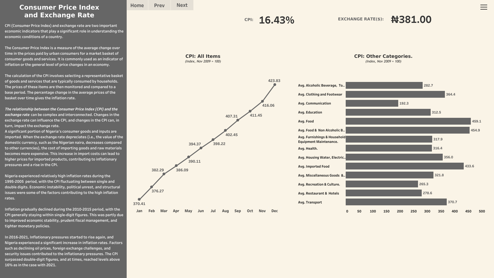
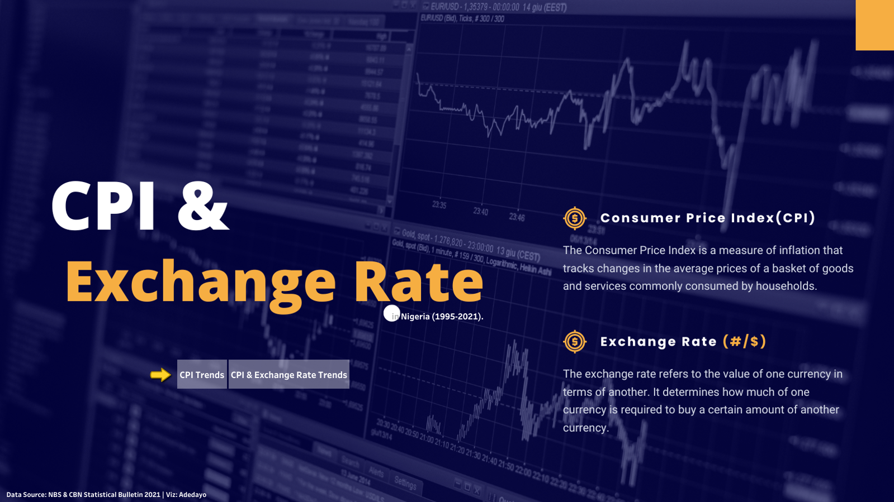

# Consumer Price Index and Exchange Rate Trends in Nigeria.

_This Tableau Project shows the trends and the relationship between Consumer Price Index(CPI) and the  Dollar to Naira Exchange Rate between 1995 - 2021 in Nigeria._

**_Disclaimer_**: _I own no sole propriety to the data used for this project. All data used in this project is gotten from CBN statistical bulletin 2021 and NBS._

CPI (Consumer Price Index) and exchange rate are two important economic indicators that play a significant role in understanding the economic conditions of a country.

The Consumer Price Index is a measure of the average change over time in the prices paid by urban consumers for a market basket of consumer goods and services. It is commonly used as an indicator of inflation or the general level of price changes in an economy.

The calculation of the CPI involves selecting a representative basket of goods and services that are typically consumed by households. The prices of these items are then monitored and compared to a base period. The percentage change in the average prices of the basket over time gives the inflation rate.

The relationship between the Consumer Price Index (CPI) and the exchange rate can be complex and interconnected. Changes in the exchange rate can influence the CPI, and changes in the CPI can, in turn, impact the exchange rate. 
A significant portion of Nigeria's consumer goods and inputs are imported. When the exchange rate depreciates (i.e., the value of the domestic currency, such as the Nigerian naira, decreases compared to other currencies), the cost of importing goods and raw materials becomes more expensive. This increase in import costs can lead to higher prices for imported products, contributing to inflationary pressures and a rise in the CPI.

 

As shown in the charts above, Nigeria experienced relatively high inflation rates during the 1995-2005  period, with the CPI fluctuating between single and double digits. Economic instability, political unrest, and structural issues were some of the factors contributing to the high inflation rates.

In 2016-2021, Inflationary pressures started to rise again, and Nigeria experienced a significant increase in inflation rates. Factors such as declining oil prices, foreign exchange challenges, and security issues contributed to the inflationary pressures. The CPI surpassed double-digit figures, and at times, reached levels above **16%** as in the case with 2021. Inquiries can be made further via CPI & Exchange Rate dashboard [here](https://tabsoft.co/3D89lPj)

In general, there is a connection between CPI and exchange rates, as changes in the exchange rate can affect the prices of imported goods and influence inflation. As shown in the graph, the relationship between CPI and Exchange Rate is a non-linear positive correlation, as an increase in the exchange rate also needs to increase in prices of household items.  Nigeria, like many other countries, imports a significant portion of its goods, including essential commodities, machinery, and raw materials. Therefore, fluctuations in the exchange rate can impact the prices of these imported items, which can, in turn, influence the overall CPI.

Moreover, Nigeria's economy is characterized by various structural challenges, including heavy reliance on oil exports, limited diversification, infrastructure deficits, and governance issues. These factors can have independent impacts on inflation and the exchange rate, further complicating the relationship between the two.

